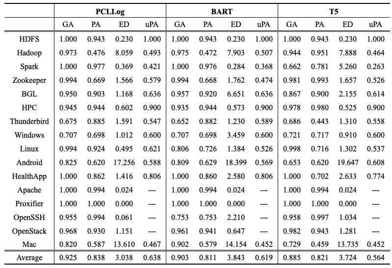
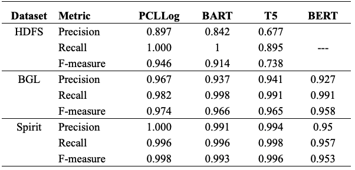
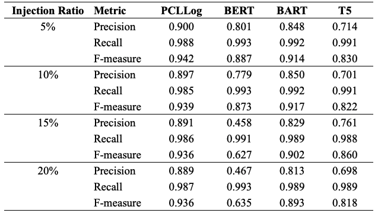
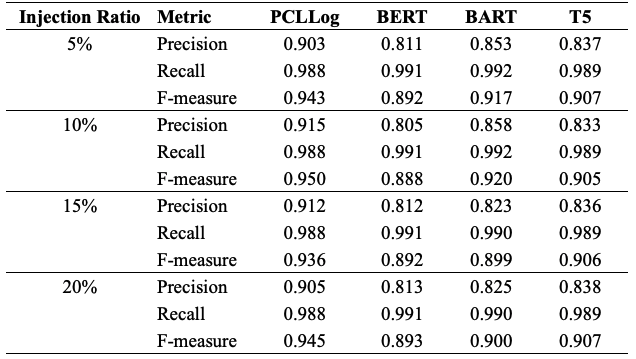

# PCLLog
Code for "Pre-training with Contrastive Learning for Unified Log Analytics"

**Abstract**: Large-scale software-intensive systems often produce a large volume of logs to record runtime status and events for troubleshooting purposes. The rich information included in log data enables a variety of log analytics tasks, such as log parsing and anomaly detection. Over the years, many approaches have been proposed for automated log analytics. However, these approaches usually design separate models for each specific task, which cannot be generalized to other tasks. They are also not robust when dealing with logs from heterogeneous sources. In this paper, we propose PCLLog, a novel pre-training sequence-to-sequence model to enable unified log analytics. PCLLog is pre-trained on a large amount of unlabelled log data to capture the semantic meaning of logs. We design two log-specific pre-training objectives, including entry-level and sequence-level objectives, which enable PCLLog to better understand the hidden structure and semantic meaning of logs. Then, we perform prompt tuning of the pre-trained model for downstream tasks. Besides, by converting downstream tasks’ objectives into the next token prediction problem, we can handle different log analytics tasks in a unified manner. Our experimental results for two downstream tasks (log template generation and log-based anomaly detection) show that PCLLog outperforms the state-of-the-art approaches that are specifically designed for each downstream task.

## 1. Framework
<p align="center"><br>An overview of PCLLog</p>

## 2. Requirements
### 2.1. Environment
- Python 3.8
- torch
- transformers
- ...

Installation guide:
```shell
$ pip install -r requirements.txt
$ cd fairseq && python setup.py install
```

### 2.2. Models and data
Download and upzip checkpoint for pre-training, a small set of pre-training data, and the pre-trained PCLLog [here](https://figshare.com/s/b62ffa904644863a2b89).

## 3. Usage
### 3.1. Pre-training PCLLog
Pre-training with a small set of data
```shell
$ ./scripts/preprocess.sh
$ ./script/pretrain.sh
```

### 3.2. Prompt Tuning PCLLog
#### 3.2.1. Generation Task
Example of Log Parsing as Generation on HDFS:
```shell
$ cd tasks/generation/logparsing
$ python train.py --dataset HDFS \
    --model-path ../../../models/PCLLog \
    --train-file ./datasets/HDFS/32shot/1.json \
    --test-file ./datasets/HDFS/test.json \
    --outdir 32shot/itr_1/PCLLog
```

Run benchmark on 16 datasets:
```shell
$ cd tasks/generation/logparsing
$ ./benchmark
```
#### 3.2.2. Classification Task
Example of Anomaly Detection as Classification on BGL with a small set of data:
```shell
$ cd task/classification
$ python train.py \
    --dataset BGL \
    --model-path ../../models/PCLLog \
    --train-file anomaly_detection/data/train.json \
    --test-file anomaly_detection/data/test.json \
    --prompt-template prompt_template.txt \
    --verbalizer anomaly_detection/verbalizer.txt 
```


Example of Failure Identification as Classification on BGL with a small set of data:
```shell
$ cd task/classification
$ python train.py \
    --dataset OpenStack \
    --model-path ../../models/PCLLog \
    --train-file failure_identification/data/train.json \
    --test-file failure_identification/data/test.json \
    --prompt-template prompt_template.txt \
    --verbalizer failure_identification/verbalizer.txt
```

Full datasets for anomaly detection and failure identification can be found [here](https://figshare.com/s/b62ffa904644863a2b89).

## 4. Results
### 4.1. RQ1: Log Parsing Results

- _**Accuracy**_:
<p align="center"></p>

- **_Robustness_**:
<p align="center"></p>

### 4.2. RQ2: Anomaly Detection Results

- **_With Stable Logs_**:
<p align="center"></p>

- **_With Unstable Log Events_**:
<p align="center"></p>

- **_With UnStable Log Sequences_**:
<p align="center"></p>


### 4.3. RQ3: Ablation Study

- **_Log Parsing_**:
<p align="center"></p>

- **_Anomaly Detection with Stable Logs_**:
<p align="center"></p>

- **_Anomaly Detection with Unstable Logs_**:
  - _Unstable Log Events_:
    <p align="center"></p>
  - _Unstable Log Sequences_
    <p align="center"></p>
### 4.4. RQ4: Compare with Different Pre-trained Models

- **_Log Parsing_**:
<p align="center"></p>


- **_Anomaly Detection with Stable Logs_**:
<p align="center"></p>

- **_Anomaly Detection with Unstable Logs_**:
  - _Unstable Log Events_:
    <p align="center"></p>
  - _Unstable Log Sequences_
    <p align="center"></p>