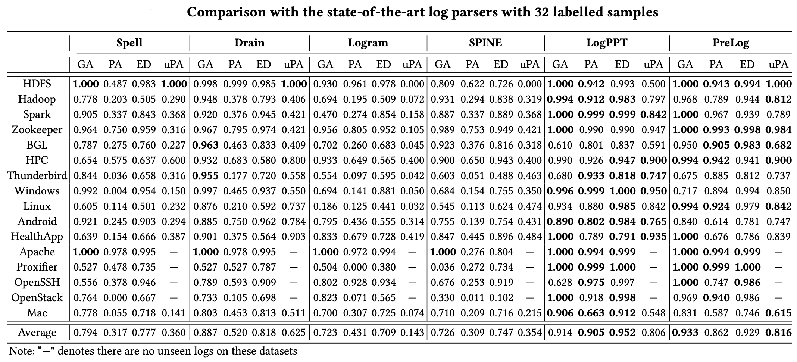
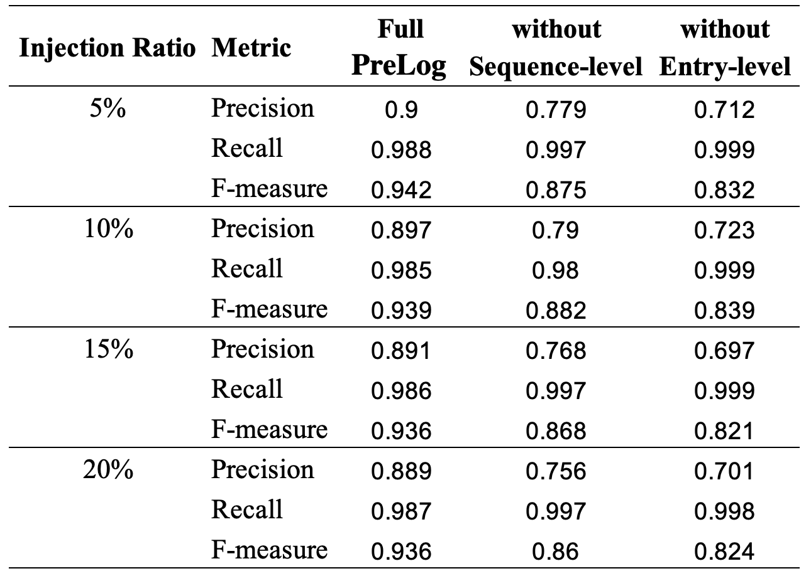

# PreLog

Code for "PreLog: A Pre-trained Model for Log Analytics"

**Abstract**: Large-scale software-intensive systems often produce a large volume of logs to record runtime status and events for troubleshooting purposes. The rich information included in log data enables a variety of log analytics tasks, such as log parsing and anomaly detection. Over the years, many approaches have been proposed for automated log analytics. However, these approaches usually design separate models for each specific task, which cannot be generalized to other tasks. They are also not robust when dealing with logs from heterogeneous sources. In this paper, we propose PreLog, a novel pre-trained sequence-to- sequence model for log analytics. PreLog is pre-trained on a large amount of unlabelled log data to capture the semantic meaning of logs. We design two log-specific pre-training objectives, including entry-level and sequence-level objectives, which enable PreLog to better understand the hidden structure and semantic meaning of logs. Then, we perform prompt tuning of the pre-trained model for downstream tasks. Besides, by converting downstream tasks’ objectives into the next token prediction problem, we can handle different log analytics tasks in a unified manner. Our experimental results for two downstream tasks (log template generation and log-based anomaly detection) show that PreLog outperforms the state-of-the-art approaches that are specifically designed for each downstream task.

## 1. Framework

<p align="center"><br>An overview of PreLog</p>

## 2. Requirements

### 2.1. Environment

- Python 3.8
- torch
- transformers
- ...

Installation guide:

```shell
$ pip install -r requirements.txt
$ cd fairseq && python setup.py install
```

### 2.2. Models and data

Download and upzip checkpoint for pre-training, a small set of pre-training data, and the pre-trained
PreLog [here](https://figshare.com/s/b62ffa904644863a2b89).

## 3. Usage

### 3.1. Pre-training PreLog

Pre-training with a small set of data

```shell
$ ./scripts/preprocess.sh
$ ./scripts/pretrain.sh
```

### 3.2. Prompt Tuning PreLog

#### 3.2.1. Generation Task

**Dataset:** We use the [corrected](https://dl.acm.org/doi/abs/10.1145/3510003.3510101) version originated
from [LogPAI benchmark](https://github.com/logpai/logparser) with 16 datasets.
The code for baselines is adopted from [LogPAI](https://github.com/logpai/logparser).

- Log Parsing as Generation on HDFS:

```shell
$ cd tasks/generation/logparsing
$ python train.py --dataset HDFS \
    --model-path ../../../models/PreLog \
    --train-file ./datasets/HDFS/32shot/1.json \
    --test-file ./datasets/HDFS/test.json \
    --outdir 32shot/itr_1/PreLog
```

- Run benchmark on 16 datasets:

```shell
$ cd tasks/generation/logparsing
$ ./benchmark
```

#### 3.2.2. Classification Task

- Anomaly Detection as Classification on BGL with a small set of data:

**Datasets:** We use commonly-used HDFS, BGL, Spirit datasets (from [[1]](https://doi.org/10.1109/ASE51524.2021.9678773)
, [[2]](http://doi.org/10.1145/3510003.3510155)). Full datasets can be found at `tasks/generation/logparsing/logs`

|                  | **Category**       | **Size** | **\#Messages** | **\#Anomalies** |
| :--------------: | :----------------: | :------: | :------------: | :-------------: |
| **HDFS**         | Distributed system | 1\.5 G   | 11,175,629     | 16,838          |
| **Blue Gene /L** | Supercomputer      | 743 M    | 4,747,963      | 348,460         |
| **Spirit**       | Supercomputer      | 1\.0 G   | 7,983,345      | 768,142         |

```shell
$ cd task/classification
$ python train.py \
    --dataset BGL \
    --model-path ../../models/PreLog \
    --train-file anomaly_detection/data/train.json \
    --test-file anomaly_detection/data/test.json \
    --prompt-template prompt_template.txt \
    --verbalizer anomaly_detection/verbalizer.txt 
```

- Failure Identification as Classification on BGL with a small set of data:

**Dataset**: We adopt the OpenStack dataset from [[3]](https://doi.org/10.1002/spe.3164). This dataset contains 3 types
of failures, including:

1. VM is destroyed ungracefully right after creation and before completely go through its life cycle;
2. After the creation of the VM, its virtual disk is removed from the host server. Unlike the former anomaly where the
   VM is destroyed, the VM configuration remains unchanged, though it does not have access to the storage space required
   for booting the operating system;
3. A disturbance is applied to the performance of Neutron, which is responsible for managing the network. In this way,
   decreasing the responsiveness time of this component led to the timeout error, and also by stopping the DHCP service
   that is charged for assigning IP to VM, the VM network is disturbed practically

|                          | **\#Sequences** |
|:------------------------:| :---------: |
|   **VM is destroyed**    |       167       |
| **VM's disk is removed** |       225       |
| **Network disturbance**  |       169       |

```shell
$ cd task/classification
$ python train.py \
    --dataset OpenStack \
    --model-path ../../models/PreLog \
    --train-file failure_identification/data/train.json \
    --test-file failure_identification/data/test.json \
    --prompt-template prompt_template.txt \
    --verbalizer failure_identification/verbalizer.txt
```

Full pre-processed datasets for anomaly detection and failure identification can be
found [here](https://figshare.com/s/b62ffa904644863a2b89).

## 4. Results

### 4.1. RQ1: Log Parsing Results

- _**Accuracy**_:

<p align="center"></p>

- **_Robustness_**:

<p align="center"></p>

### 4.2. RQ2: Anomaly Detection Results

- **_With Stable Logs_**:

<p align="center"></p>

- **_With Unstable Log Events_**:

<p align="center"></p>

- **_With UnStable Log Sequences_**:

<p align="center"></p>

### 4.3. RQ3: Ablation Study

- **_Log Parsing_**:

<p align="center"></p>

- **_Anomaly Detection with Stable Logs_**:

<p align="center"></p>

- **_Anomaly Detection with Unstable Logs_**:
    - _Unstable Log Events_:
      <p align="center"></p>
    - _Unstable Log Sequences_
      <p align="center"></p>

[//]: # ()
[//]: # (### 4.4. RQ4: Compare with Different Pre-trained Models)

[//]: # ()
[//]: # (- **_Log Parsing_**:)

[//]: # ()
[//]: # (<p align="center"></p>)

[//]: # ()
[//]: # (- **_Anomaly Detection with Stable Logs_**:)

[//]: # ()
[//]: # (<p align="center"></p>)

[//]: # ()
[//]: # (- **_Anomaly Detection with Unstable Logs_**:)

[//]: # (    - _Unstable Log Events_:)

[//]: # (      <p align="center"></p>)

[//]: # (    - _Unstable Log Sequences_)

[//]: # (      <p align="center"></p>)

### 4.4. Preliminary Results for Failure Identification on OpenStack

<p align="center"></p>
