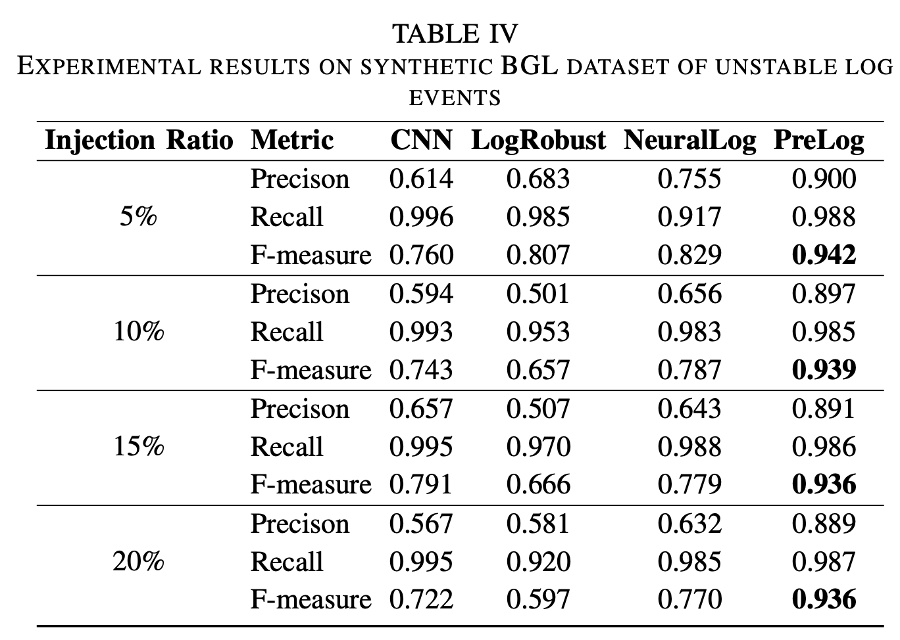
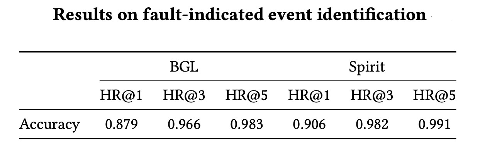

# PreLog: Pre-training for Log Analytics

**Abstract**: Large-scale software-intensive systems often produce a large volume of logs to record runtime status and events for troubleshooting purposes. The rich information in log data enables a variety of system management and diagnosis tasks. Over the years, many approaches have been proposed for automated log analytics. However, these approaches usually design separate models for each specific task, which cannot be generalized to other tasks. They are also not robust when dealing with logs from heterogeneous sources. In this paper, we propose PreLog, a novel pre-trained model for log analytics. PreLog is pre-trained on a large amount of unlabelled log data to capture the semantic meaning of logs. We design two log-specific pre-training objectives, including entry-level and sequence-level objectives, which enable PreLog to better understand the hidden structure and semantic meaning of logs. To perform downstream log analytics tasks, we leverage a prompt tuning paradigm to convert downstream tasks’ objectives into a similar form as the pre-training stage. We have conducted extensive experiments on two main log analytics tasks (i.e., log parsing and log-based anomaly detection). Experimental results show that PreLog achieves better or comparable results in comparison with the state-of-the-art, task-specific approaches. PreLog is cost-effective and can be uniformly applied to many log analytics tasks through the prompt tuning paradigm.

## <u> Additional Results:</u>
### A. Prompt Tuning vs. Fine-tuning
To demonstrate the benefits of the current prompt tuning design (i.e., hard prompt tuning), we conduct additional experiments on anomaly detection.
We the following settings:
- Hard prompt (i.e., the current design of PreLog): We use the template of **"[S] This sequence is [MASK]"**, where **[S]** and **[MASK]** are the unfilled slots for the input log sequence and label, respectively.
- Soft prompt: We use the template of **"[S] [SOFT] [SOFT] [SOFT] * 3 [MASK]"**, where **[S]** and **[MASK]** are the unfilled slots for the input log sequence and label, respectively. **[SOFT]** is a soft/virtual token for soft prompt tuning.
- Fine tune (freeze LM): We freeze the pre-trained PreLog and only fine-tune the classification head.
- Fine tune (full parameters): We add a classification head on top of the pre-trained PreLog and fine-tune all parameters.

#### A1. Results with stable logs

|  Dataset   |   Metric   | Hard Prompt<br/>(PreLog) | Soft Prompt | Fine tune<br/>(freeze LM) | Fine tune<br/>(full params) |
|:----------:|:----------:|:------------------------:|:-----------:|:-------------------------:|:---------------------------:|
|  **HDFS**  | Precision  |          0.897           |    0.601    |           0.709           |            0.599            |
|            |   Recall   |           1.0            |    0.953    |           0.504           |            0.988            |
|            | F-measure  |        **0.946**         |    0.737    |           0.589           |            0.746            |
|  **BGL**   | Precision  |          0.967           |    0.909    |           0.857           |            0.924            |
|            |   Recall   |          0.982           |    0.998    |           0.914           |            0.998            |
|            | F-measure  |        **0.974**         |    0.952    |           0.885           |            0.960            |
| **Spirit** | Precision  |           1.0            |    0.752    |           0.355           |            0.687            |
|            |   Recall   |          0.996           |    0.848    |           0.984           |            0.918            |
|            | F-measure  |        **0.998**         |    0.797    |           0.521           |            0.784            |


#### A2. Results with unstable log events
| Injection Ratio |   Metric  | Hard Prompt<br/>(PreLog) | Soft Prompt | Fine tune<br/>(freeze LM) | Fine tune<br/>(full params) |
|:---------------:|:---------:|:------------------------:|:-----------:|:-------------------------:|:---------------------------:|
|        5%       | Precision |          0.900           |    0.735    |           0.550           |            0.762            |
|                 | Recall    |          0.988           |    0.999    |           0.532           |            0.999            |
|                 | F-measure |        **0.942**         |    0.847    |           0.541           |            0.865            |
|       10%       | Precision |          0.897           |    0.748    |           0.259           |            0.748            |
|                 | Recall    |          0.985           |    0.999    |           0.55            |            0.999            |
|                 | F-measure |        **0.939**         |    0.855    |           0.351           |            0.856            |
|       15%       | Precision |          0.891           |    0.721    |           0.657           |            0.725            |
|                 | Recall    |          0.986           |    0.999    |           0.872           |            0.999            |
|                 | F-measure |        **0.939**         |    0.837    |           0.749           |            0.841            |
|       20%       | Precision |          0.889           |    0.722    |           0.644           |            0.729            |
|                 | Recall    |          0.987           |    0.998    |           0.898           |            0.999            |
|                 | F-measure |        **0.936**         |    0.838    |           0.750           |            0.843            |

#### A3. Results with unstable log sequences
| Injection Ratio |   Metric  | Hard Prompt<br>(PreLog) | Soft Prompt | Fine tune<br>(freeze LM) | Fine tune<br>(full params) |
|:---------------:|:---------:|:-----------------------:|:-----------:|:------------------------:|:--------------------------:|
|        5%       | Precision |          0.903          |    0.735    |           0.688          |            0.814           |
|                 | Recall    |          0.988          |    0.999    |           0.916          |            0.998           |
|                 | F-measure |        **0.943**        |    0.847    |           0.786          |            0.897           |
|       10%       | Precision |          0.915          |    0.748    |           0.682          |            0.816           |
|                 | Recall    |          0.988          |    0.999    |           0.916          |            0.998           |
|                 | F-measure |        **0.950**        |    0.855    |           0.782          |            0.898           |
|       15%       | Precision |          0.912          |    0.721    |           0.646          |            0.807           |
|                 | Recall    |          0.988          |    0.999    |           0.916          |            0.998           |
|                 | F-measure |        **0.936**        |    0.837    |           0.753          |            0.893           |
|       20%       | Precision |          0.905          |    0.722    |           0.593          |            0.804           |
|                 | Recall    |          0.988          |    0.998    |           0.916          |            0.998           |
|                 | F-measure |        **0.945**        |    0.838    |           0.720          |            0.891           |


#### **Findings**

- PreLog performs the best with hard prompt tuning.
- Fine-tuning with only a small data cannot achieve as good results as hard prompt tuning.
- Soft prompt tuning can achieve similar results as fine-tuning.
- Only fine-tuning the classification head (i.e., freeze LM) perform the worst.

### B. Pre-training

To verify the contributions of pre-training, we leverage the model architecture of PreLog to train a model from scratch (w/o pre-training) for anomaly detection.

#### B1. Results on stable logs

|  Dataset   |   Metric   | PreLog (w/ Pre-training) | PreLog (w/o Pre-training) |
|:----------:|:----------:|:------------------------:|:-------------------------:|
|  **HDFS**  | Precision  |          0.897           |           0.751           |
|            |   Recall   |           1.0            |            0.987            |
|            | F-measure  |        **0.946**         |          0.853            |
|  **BGL**   | Precision  |          0.967           |           0.818           |
|            |   Recall   |          0.982           |           0.968           |
|            | F-measure  |        **0.974**         |          0.886            |
| **Spirit** | Precision  |           1.0            |            0.987            |
|            |   Recall   |          0.996           |           0.994           |
|            | F-measure  |        **0.998**         |          0.990            |

#### B2. Results on unstable log events

| Injection Ratio |   Metric  | PreLog (w/ Pre-training) | PreLog (w/o Pre-training) |
|:---------------:|:---------:|:------------------------:|:-------------------------:|
|        5%       | Precision |          0.900           |           0.446           |
|                 | Recall    |          0.988           |           0.959           |
|                 | F-measure |        **0.942**         |          0.608            |
|       10%       | Precision |          0.897           |           0.579           |
|                 | Recall    |          0.985           |           0.956           |
|                 | F-measure |        **0.939**         |          0.721            |
|       15%       | Precision |          0.891           |           0.453           |
|                 | Recall    |          0.986           |           0.959           |
|                 | F-measure |        **0.939**         |          0.616            |
|       20%       | Precision |          0.889           |           0.527           |
|                 | Recall    |          0.987           |           0.955           |
|                 | F-measure |        **0.936**         |          0.679            |


#### B3. Results on unstable log sequences

| Injection Ratio |   Metric  | PreLog (w/ Pre-training) | PreLog (w/o Pre-training) |
|:---------------:|:---------:|:------------------------:|:-------------------------:|
|        5%       | Precision |          0.903           |           0.599           |
|                 | Recall    |          0.988           |           0.967           |
|                 | F-measure |        **0.943**         |          0.740            |
|       10%       | Precision |          0.915           |           0.505           |
|                 | Recall    |          0.988           |           0.967           |
|                 | F-measure |        **0.950**         |          0.663            |
|       15%       | Precision |          0.912           |           0.549           |
|                 | Recall    |          0.988           |           0.967           |
|                 | F-measure |        **0.936**         |          0.700            |
|       20%       | Precision |          0.905           |           0.508           |
|                 | Recall    |          0.988           |           0.967           |
|                 | F-measure |        **0.945**         |          0.666            |

#### **Findings:**
The model fails to achieve satisfactory performance without pre-training


### C. Efficiency and Comparison with LLMs

We fine-tune a FLAN-T5 model, an enhanced version of T5, for log-based anomaly detection and compare it with PreLog. We choose the FLAN- T5 XL version with 3 billion parameters (approximately 20 times larger than PreLog) and fine-tune it using Low-Rank Adaptation (LoRA).

#### C1. Results on stable logs

| Dataset   |   Metric   | PreLog (140M) | FLAN-T5 (3B) |
|:---------:|:----------:|:-------------:|:------------:|
| **HDFS**  | Precision  |     0.897     |     0.790    |
|           |   Recall   |      1.0      |      1.0     |
|           | F-measure  |   **0.946**   |   0.870  |
|           |  $T_{infer}$ with V100 GPU  |     **12 ms**     |     timeout    |
|        |  $T_{infer}$ with A100 GPU  |     **7 ms**     |     245 ms    |
| **BGL**   | Precision  |     0.967     |     0.961    |
|           |   Recall   |     0.982     |     0.995    |
|           | F-measure  |   0.974   |   **0.977**  |
|           |  $T_{infer}$ with V100 GPU  |     **12 ms**     |     392 ms    |
|        |  $T_{infer}$ with A100 GPU  |     **7 ms**     |     265 ms    |
| **Spirit** | Precision  |      1.0      |      0.997     |
|           |   Recall   |     0.996     |     0.996    |
|           | F-measure  |   **0.998**   |   0.996  |
|           |  $T_{infer}$ with V100 GPU  |     **11 ms**     |     386 ms    |
|        |  $T_{infer}$ with A100 GPU  |     **7 ms**     |     247 ms    |


#### C2. Results on unstable log events

| Injection Ratio |   Metric  | PreLog (140M) | FLAN-T5 (3B) |
|:---------------:|:---------:|:-------------:|:------------:|
|        5%       | Precision |     0.900     |     0.839    |
|                 | Recall    |     0.988     |     0.992    |
|                 | F-measure |   **0.942**   |      0.909  |
|        10%      | Precision |     0.897     |     0.867    |
|                 | Recall    |     0.985     |     0.992    |
|                 | F-measure |   **0.939**   |   0.925  |
|        15%      | Precision |     0.891     |     0.727    |
|                 | Recall    |     0.986     |     0.997    |
|                 | F-measure |   **0.939**   |   0.841  |
|        20%      | Precision |     0.889     |     0.725    |
|                 | Recall    |     0.987     |     0.992    |
|                 | F-measure |   **0.936**   |   0.834  |


#### C3. Results on unstable log sequences

| Injection Ratio |   Metric  | PreLog (140M) | FLAN-T5 (3B) |
|:---------------:|:---------:|:-------------:|:------------:|
|        5%       | Precision |     0.903     |     0.865    |
|                 | Recall    |     0.988     |     0.996    |
|                 | F-measure |   **0.943**   |   0.926  |
|        10%      | Precision |     0.915     |     0.996   |
|                 | Recall    |     0.988     |     0.992    |
|                 | F-measure |   **0.950**   |   0.926  |
|        15%      | Precision |     0.912     |     0.870    |
|                 | Recall    |     0.988     |     0.996    |
|                 | F-measure |   **0.936**   |   0.929  |
|        20%      | Precision |     0.905     |     0.844    |
|                 | Recall    |     0.988     |     0.995    |
|                 | F-measure |   **0.945**   |   0.926  |


#### **Findings:**
- PreLog achieves better or comparable results with FLAN-T5 with 20 times fewer parameters.
- PreLog is much more efficient than FLAN-T5, making it more suitable for real-world applications.
- PreLog is more robust than FLAN-T5 when dealing with unstable log data.


## 1. Framework

<p align="center"><br>An overview of PreLog</p>

## 2. Requirements

### 2.1. Environment

- Python >= 3.8
- torch
- transformers
- accelerate
- ...

Installation guide:

```shell
$ pip install -r requirements.txt
$ cd fairseq && python setup.py install
```


### 2.2. Models and data

Download and unzip checkpoint for pre-training, a small set of pre-training data, and the pre-trained
PreLog [here](https://figshare.com/s/5a08ef8b02b94f6726c2).

## 3. Usage

### 3.1. Pre-training PreLog

- Tokenize and binarize data:

```shell
# set path to raw pre-training data (DATA_DIR) in scripts/preprocess.sh and run
$ ./scripts/preprocess.sh
```

- Pre-train PreLog:

```shell
# set path to tokenized pre-training data (DATA_DIR), path to save model (SAVE_DIR), checkpoint (CHECKPOINT_PATH) in scripts/pretrain.sh and run 
$ ./scripts/pretrain.sh
```

- Convert checkpoint to huggingface format:

```shell
# set path to save model (CHECKPOINT_PATH) in scripts/convert_fairseq_to_hf.py and run
$ python ./scripts/convert_fairseq_to_hf.py
```

### 3.2. Prompt Tuning PreLog

#### 3.2.1. Generation Task

- Log Parsing as Generation:

  **Dataset:** We use the [corrected](https://dl.acm.org/doi/abs/10.1145/3510003.3510101) version originated
  from [LogPAI benchmark](https://github.com/logpai/logparser) with 16 datasets. The statistics of these datasets are as
  follows:

|   **Dataset**   | Spark | OpenStack | Windows | Apache | OpenSSH | Proxifier | HealthApp | Thunderbird | HPC | Android | HDFS | BGL | Zookeeper | Mac | Hadoop | Linux |
| :-----: | :-----: | :-----: | :-----: | :-----: | :-----: | :-----: | :-----: | :-----: | :-----: | :-----: | :-----: | :-----: | :-----: | :-----: | :-----: | :-----: |
| **\#Templates** | 36 | 43 | 50 | 6 | 26 | 8 | 75 | 149 | 45 | 158 | 14 | 120 | 50 | 341 | 114 | 116 |

```shell
# to run on HDFS dataset
$ cd tasks/generation/logparsing
$ export MODEL_PATH="path to PreLog model"    # default: ../PreLog
$ accelerate launch train.py \
    --dataset HDFS \
    --model-path $MODEL_PATH \
    --train-file data/HDFS/32shot/1.json \  # path to training data
    --test-file data/HDFS/test.json \   # path to test data
    --outdir parsing_hdfs
```

- Run benchmark on 16 datasets:

```shell
# set path to PreLog model (MODEL_PATH) in tasks/generation/benchmark.sh and run
$ cd tasks/generation
$ ./benchmark.sh
```

#### 3.2.2. Classification Task

- Anomaly Detection as Classification:

  **Datasets:** We use commonly-used HDFS, BGL, Spirit datasets (from [[1]](https://doi.org/10.1109/ASE51524.2021.9678773), [[2]](http://doi.org/10.1145/3510003.3510155)). The statistics of these datasets are shown in the following table:

|                  | **Category**       | **Size** | **\#Messages** | **\#Anomalies** |
| :--------------: | :----------------: | :------: | :------------: | :-------------: |
| **HDFS**         | Distributed system | 1\.5 G   | 11,175,629     | 16,838          |
| **Blue Gene /L** | Supercomputer      | 743 M    | 4,747,963      | 348,460         |
| **Spirit**       | Supercomputer      | 1\.0 G   | 7,983,345      | 768,142         |

```shell
$ cd task/classification
$ export MODEL_PATH="path to PreLog model"    # default: ../PreLog
$ accelerate launch train.py \
    --dataset BGL \
    --model-path $MODEL_PATH \
    --train-file anomaly_detection/data/BGL/train/1.json \  # path to training data
    --test-file anomaly_detection/data/BGL/test.json \  # path to test data
    --prompt-template prompt_template.txt \ 
    --verbalizer anomaly_detection/verbalizer.txt \
    --batch-size 16 \
    --lr 3e-5 \
    --max-step 2000 \
    --lr-scheduler-type polynomial \
    --max-length 1024 \
    --do-train \
    --do-eval
```

- Failure Identification as Classification:

  **Dataset**: We adopt the OpenStack dataset from [[3]](https://doi.org/10.1002/spe.3164). This dataset contains 3 types
  of failures, including:
1. VM is destroyed ungracefully right after creation and before completely go through its life cycle;
2. After the creation of the VM, its virtual disk is removed from the host server. Unlike the former anomaly where the VM is destroyed, the VM configuration remains unchanged, though it does not have access to the storage space required for booting the operating system;
3. A disturbance is applied to the performance of Neutron, which is responsible for managing the network. In this way, decreasing the responsiveness time of this component led to the timeout error, and also by stopping the DHCP service that is charged for assigning IP to VM, the VM network is disturbed practically

|                          | **\#Sequences** |
|:------------------------:|:---------------:|
|   **VM is destroyed**    |       167       |
| **VM's disk is removed** |       225       |
| **Network disturbance**  |       169       |

```shell
$ cd task/classification
$ export MODEL_PATH="path to PreLog model"    # default: ../PreLog
$ accelerate launch train.py \
    --dataset OpenStack \
    --model-path $MODEL_PATH \
    --train-file failure_identification/data/OpenStack/train.json \   # path to training data
    --test-file failure_identification/data/OpenStack/test.json \   # path to test data
    --prompt-template prompt_template.txt \
    --verbalizer failure_identification/verbalizer.txt \
    --batch-size 16 \
    --lr 3e-5 \
    --max-step 2000 \
    --lr-scheduler-type polynomial \
    --max-length 1024 \
    --do-train \
    --do-eval
```

## 4. Results

### 4.1. RQ1: Log Parsing

We evaluate the accuracy of log parsing performed by PreLog. We compare PreLog with the top-performing data-driven log parsers, i.e., Spell, Drain, Logram, and SPINE; and the current state-of-the-art DL-based log parser, i.e., LogPPT.

- Source code for Spell, Drain, and Logram is adopted from [LogPAI](https://github.com/logpai/logparser) and [empirical study](https://figshare.com/articles/software/Artifact_for_Guidelines_for_Assessing_the_Accuracy_of_Log_Message_Template_Identification_Techniques_/18858332).
- We use the implementation provided by authors for [SPINE](https://doi.org/10.1145/3540250.3549176).
- Source for LogPPT is adopted from [LogPPT](https://github.com/LogIntelligence/LogPPT).

<p align="center"></p>

<p align="center"></p>

**Take-home points:**
- PreLog achieves the best GA on 9 out of 16 datasets, a GA of over 0.9 on 12 datasets and 1.0 accuracy on seven datasets.
- PreLog significantly outperforms data-driven log parsers and achieves comparable results with LogPPT.
- The performance of PreLog can be improved if more labelled samples are provided, and it can achieve good results with 16 or more labelled samples.

### 4.2. RQ2: Anomaly Detection

We compare PreLog with CNN, LogRobust, and NeuralLog, which are the state-of-the-arts on anomaly detection.

- **_With Stable Logs_**:

<p align="center"></p>

- **_With Unstable Log Events_**:

<p align="center"></p>

- **_With UnStable Log Sequences_**:

<p align="center"></p>

**Take-home points:**
- PreLog can capture the semantic meaning of log sequences more effectively via pre-training on a large amount of data, thus leading to the better results compared to the state-of-the-art.
- PreLog maintains a consistently high accuracy (F-measure ranging from 0.936 to 0.942 with unstable log events and from 0.936 to 0.950 with unstable log sequences) under high injection ratios.
- PreLog is effective and robust for log-based anomaly detection on both stable and unstable log data.

### 4.3. RQ3: Ablation Study
We evaluate the effectiveness of each pre-training objective when the model is trained without it.
- **_Log Parsing_**:

<p align="center"></p>

- **_Anomaly Detection with Stable Logs_**:

<p align="center"></p>

- **_Anomaly Detection with Unstable Logs_**:
    - _Unstable Log Events_:
      <p align="center"></p>
    - _Unstable Log Sequences_
      <p align="center"></p>

**Take-home points:**
- Pre-training with both entry-level and sequence-level objectives is important for log parsing.
- PreLog performs worse when one of the pre-training objectives is excluded on unstable log data.
    
### 4.4. Other log analytics tasks

- Failure Identification on OpenStack:

    We ask PreLog to identify the failure types of OpenStack system. The results show that PreLog can achieve an F-measure of over 0.95 for all failure types on the OpenStack dataset.

<p align="center"></p>

- Fault-indicated Event Identification:
    
    We ask PreLog to locate the logs in log sequence that are most likely to cause anomalies. By leveraging attention scores assigned for each log message, PreLog can locate anomalies in log sequences with high accuracy, especially on the Spirit dataset.

<p align="center"></p>

**Take-home points:**
- PreLog can be applied to other log analytics tasks with a prompt tuning paradigm.
- PreLog can achieve good results on other log analytics tasks.


## 5. Full supplementary
A complete version of the supplementary with python environment, unpacked models, and data can be found [here](https://drive.google.com/file/d/1kXLcGqhtCyWBjpXKAWE1vhTZekcOfKUb/view?usp=sharing).


To use pre-built enviroment:
```shell
$ source prelog_env/bin/activate
```

## Acknowledgement
- Baselines and evaluation metrics for log parsing are adopted from [logparser](https://github.com/logpai/logparser)
and an [empirical study](https://figshare.com/articles/software/Artifact_for_Guidelines_for_Assessing_the_Accuracy_of_Log_Message_Template_Identification_Techniques_/18858332).

- Baselines and evaluation metrics for anomaly detection are adopted from [LogADEmpirical](https://github.com/LogIntelligence/LogADEmpirical).

- We use the implementation provided by authors for [SPINE](https://doi.org/10.1145/3540250.3549176) and [LogPPT](https://doi.org/10.1109/ICSE48619.2023.00204).
