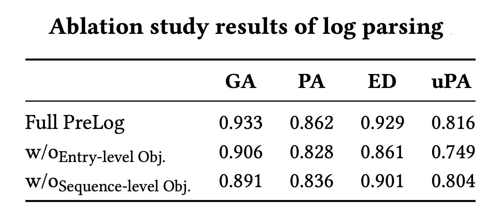
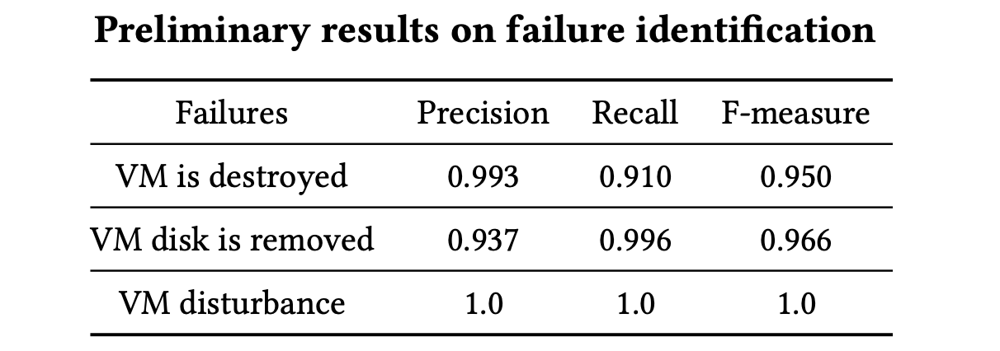

# PreLog: Pre-training for Log Analytics

**Abstract**: Large-scale software-intensive systems often produce a large volume of logs to record runtime status and
events for troubleshooting purposes. The rich information included in log data enables a variety of log analytics tasks,
such as log parsing and anomaly detection. Over the years, many approaches have been proposed for automated log
analytics. However, these approaches usually design separate models for each specific task, which cannot be generalized
to other tasks. They are also not robust when dealing with logs from heterogeneous sources. In this paper, we propose
PreLog, a novel pre-trained sequence-to-sequence model for log analytics. PreLog is pre-trained on a large amount of
unlabelled log data to capture the semantic meaning of logs. We design two log-specific pre-training objectives,
including entry-level and sequence-level objectives, which enable PreLog to better understand the hidden structure and
semantic meaning of logs. To perform downstream tasks, we leverage a prompt tuning paradigm to convert downstream tasks’
objectives into a similar form as the pre-training stage. We have conducted extensive experiments on two main downstream
tasks (i.e., log parsing and log-based anomaly detection). Experimental results show that PreLog achieves better or
comparable results in comparison with the state-of-the-art, task-specific approaches. PreLog is cost-effective and can
be uniformly applied to many log analytics tasks through a prompt tuning paradigm.

## 1. Framework

<p align="center"><br>An overview of PreLog</p>

## 2. Requirements

### 2.1. Environment

- Python 3.8
- torch
- transformers
- accelerate
- ...

Installation guide:

```shell
$ pip install -r requirements.txt
$ cd fairseq && python setup.py install
```

### 2.2. Models and data

Download and unzip checkpoint for pre-training, a small set of pre-training data, and the pre-trained
PreLog [here](https://figshare.com/s/5a08ef8b02b94f6726c2).

## 3. Usage

### 3.1. Pre-training PreLog

- Tokenize and binarize data:

```shell
# set path to raw pre-training data (DATA_DIR) in scripts/preprocess.sh and run
$ ./scripts/preprocess.sh
```

- Pre-train PreLog:

```shell
# set path to tokenized pre-training data (DATA_DIR), path to save model (SAVE_DIR), checkpoint (CHECKPOINT_PATH) in scripts/pretrain.sh and run 
$ ./scripts/pretrain.sh
```

- Convert checkpoint to huggingface format:

```shell
# set path to save model (CHECKPOINT_PATH) in scripts/convert_fairseq_to_hf.py and run
$ python ./scripts/convert_fairseq_to_hf.py
```

### 3.2. Prompt Tuning PreLog

#### 3.2.1. Generation Task

- Log Parsing as Generation:

  **Dataset:** We use the [corrected](https://dl.acm.org/doi/abs/10.1145/3510003.3510101) version originated
  from [LogPAI benchmark](https://github.com/logpai/logparser) with 16 datasets. The statistics of these datasets are as
  follows:

|   **Dataset**   | Spark | OpenStack | Windows | Apache | OpenSSH | Proxifier | HealthApp | Thunderbird | HPC | Android | HDFS | BGL | Zookeeper | Mac | Hadoop | Linux |
| :-----: | :-----: | :-----: | :-----: | :-----: | :-----: | :-----: | :-----: | :-----: | :-----: | :-----: | :-----: | :-----: | :-----: | :-----: | :-----: | :-----: |
| **\#Templates** | 36 | 43 | 50 | 6 | 26 | 8 | 75 | 149 | 45 | 158 | 14 | 120 | 50 | 341 | 114 | 116 |

```shell
# to run on HDFS dataset
$ cd tasks/generation/logparsing
$ export MODEL_PATH="path to PreLog model"
$ accelerate launch train.py \
    --dataset HDFS \
    --model-path $MODEL_PATH \
    --train-file data/HDFS/32shot/1.json \
    --test-file data/HDFS/test.json \
    --outdir parsing_hdfs
```

- Run benchmark on 16 datasets:

```shell
# set path to PreLog model (MODEL_PATH) in tasks/generation/benchmark.sh and run
$ cd tasks/generation
$ ./benchmark.sh
```

#### 3.2.2. Classification Task

- Anomaly Detection as Classification:

  **Datasets:** We use commonly-used HDFS, BGL, Spirit datasets (from [[1]](https://doi.org/10.1109/ASE51524.2021.9678773), [[2]](http://doi.org/10.1145/3510003.3510155)). The statistics of these datasets are shown in the following table:

|                  | **Category**       | **Size** | **\#Messages** | **\#Anomalies** |
| :--------------: | :----------------: | :------: | :------------: | :-------------: |
| **HDFS**         | Distributed system | 1\.5 G   | 11,175,629     | 16,838          |
| **Blue Gene /L** | Supercomputer      | 743 M    | 4,747,963      | 348,460         |
| **Spirit**       | Supercomputer      | 1\.0 G   | 7,983,345      | 768,142         |

```shell
$ cd task/classification
$ export MODEL_PATH="path to PreLog model"
$ export DATADIR="path to anomaly detection data"
$ accelerate launch train.py \
    --dataset BGL \
    --model-path $MODEL_PATH \
    --train-file $DATADIR/train.json \
    --test-file $DATADIR/test.json \
    --prompt-template prompt_template.txt \
    --verbalizer anomaly_detection/verbalizer.txt \
    --batch-size 16 \
    --lr 3e-5 \
    --max-step 2000 \
    --lr-scheduler-type polynomial \
    --max-length 1024 \
    --do-train \
    --do-eval
```

- Failure Identification as Classification:

  **Dataset**: We adopt the OpenStack dataset from [[3]](https://doi.org/10.1002/spe.3164). This dataset contains 3 types
  of failures, including:
1. VM is destroyed ungracefully right after creation and before completely go through its life cycle;
2. After the creation of the VM, its virtual disk is removed from the host server. Unlike the former anomaly where the VM is destroyed, the VM configuration remains unchanged, though it does not have access to the storage space required for booting the operating system;
3. A disturbance is applied to the performance of Neutron, which is responsible for managing the network. In this way, decreasing the responsiveness time of this component led to the timeout error, and also by stopping the DHCP service that is charged for assigning IP to VM, the VM network is disturbed practically

|                          | **\#Sequences** |
|:------------------------:|:---------------:|
|   **VM is destroyed**    |       167       |
| **VM's disk is removed** |       225       |
| **Network disturbance**  |       169       |

```shell
$ cd task/classification
$ export MODEL_PATH="path to PreLog model"
$ export DATADIR="path to failure identification data"
$ accelerate launch train.py \
    --dataset BGL \
    --model-path $MODEL_PATH \
    --train-file $DATADIR/train.json \
    --test-file $DATADIR/test.json \
    --prompt-template prompt_template.txt \
    --verbalizer failure_identification/verbalizer.txt \
    --batch-size 16 \
    --lr 3e-5 \
    --max-step 2000 \
    --lr-scheduler-type polynomial \
    --max-length 1024 \
    --do-train \
    --do-eval
```

## 4. Results

### 4.1. RQ1: Log Parsing Results

<p align="center"></p>


<p align="center"></p>

### 4.2. RQ2: Anomaly Detection Results

- **_With Stable Logs_**:

<p align="center"></p>

- **_With Unstable Log Events_**:

<p align="center"></p>

- **_With UnStable Log Sequences_**:

<p align="center"></p>

### 4.3. RQ3: Ablation Study

- **_Log Parsing_**:

<p align="center"></p>

- **_Anomaly Detection with Stable Logs_**:

<p align="center"></p>

- **_Anomaly Detection with Unstable Logs_**:
    - _Unstable Log Events_:
      <p align="center"></p>
    - _Unstable Log Sequences_
      <p align="center"></p>

[//]: # ()

[//]: # (### 4.4. RQ4: Compare with Different Pre-trained Models)

[//]: # ()

[//]: # (- **_Log Parsing_**:)

[//]: # ()

[//]: # (<p align="center"></p>)

[//]: # ()

[//]: # (- **_Anomaly Detection with Stable Logs_**:)

[//]: # ()

[//]: # (<p align="center"></p>)

[//]: # ()

[//]: # (- **_Anomaly Detection with Unstable Logs_**:)

[//]: # (    - _Unstable Log Events_:)

[//]: # (      <p align="center"></p>)

[//]: # (    - _Unstable Log Sequences_)

[//]: # (      <p align="center"></p>)

### 4.4. Other log analytics tasks

- Failure Identification on OpenStack:

<p align="center"></p>

- Fault-indicated Event Identification:

<p align="center"></p>
